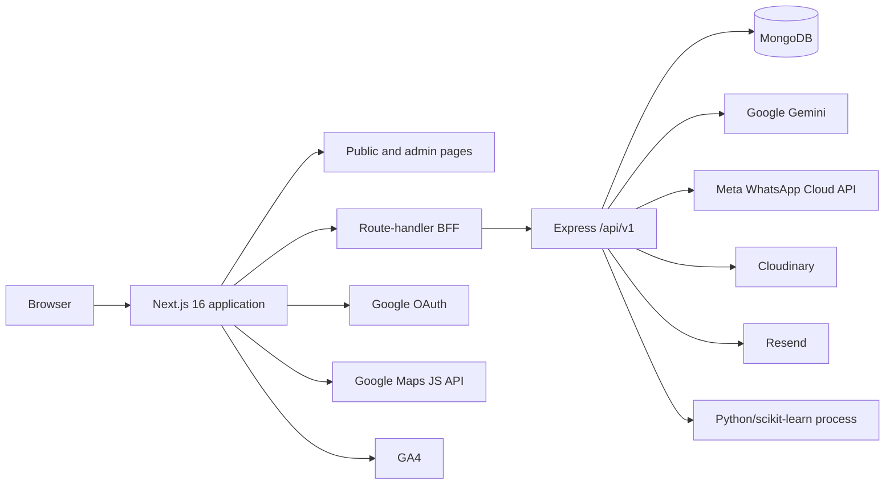

# Olinethra Technical Documentation

This directory is the engineering source of truth for the repository as audited on 2026-08-29. It describes implemented code, not the product aspirations in planning material. Status terms mean: **Implemented** (reachable code exists), **Partial** (code exists with a material gap), **Configuration required** (implemented but dependent on external credentials/services), and **Not found**.

## What Olinethra is

Olinethra is an engineering-studio website with a content/admin portal, an Express/MongoDB API, public and WhatsApp assistants, an Insights publishing workflow, quotation archiving, and an optional Python lead-conversion model.

## Architecture at a glance

The public website is partly static/local-data driven. Insights use server-side API reads with a local fallback. Admin screens call same-origin Next.js route handlers, which forward cookies and requests to Express. Express owns authorization, persistence, integrations, scheduled expiry processing, and ML process execution.

## Applications and stack

| Layer | Technology | Purpose |
| --- | --- | --- |
| Web/BFF | Next.js 16.3 App Router, React 19.2, TypeScript 5 | Public pages, admin UI, OAuth orchestration, same-origin API proxy |
| UI | Tailwind CSS 4, Radix UI, Lucide | Styling and interactive primitives |
| API | Node.js 20+, Express 4, TypeScript | `/api/v1`, policy enforcement, orchestration |
| Data | MongoDB, Mongoose 8 | 20 application models |
| Validation/security | Zod, Helmet, CORS, express-rate-limit, JWT, bcrypt | Request and session controls |
| AI | Gemini 2.0 Flash REST API | Chat, Insights drafting, WhatsApp agent |
| Lead intelligence | Python, scikit-learn tooling | Readiness, training and scoring |
| Media/email | Cloudinary, Resend | PDF archive/media helper and transactional email |
| Maps/analytics | Google Maps JS API, GA4 | Location UI and page measurement |

## Documentation navigation

- New developer: [local development](operations/local-development.md), [architecture](architecture/overview.md), [API reference](api/reference.md)
- Frontend: [frontend architecture and routes](architecture/frontend.md), [features](features/features.md)
- Backend: [backend architecture](architecture/backend.md), [models](database/models.md), [integrations](integrations/integrations.md)
- Admin/operations: [admin features](features/admin.md), [reports](reports/reports.md), [deployment](operations/deployment.md), [troubleshooting](operations/troubleshooting.md)
- Security review: [authentication/RBAC](security/authentication-and-rbac.md), [controls and risks](security/security-controls.md)
- QA: [testing](testing/testing.md), [known gaps](findings.md)
- Audit result: [final technical documentation report](audit-report.md)

## Status matrix

| Feature | Status | Notes |
| --- | --- | --- |
| Public studio website | Implemented | Mostly repository data; projects and Insights have dynamic detail routes |
| Admin CMS | Implemented | One legacy action endpoint serves multiple entities |
| Local and Google admin login | Implemented / configuration required | Google needs client configuration; local password remains supported |
| Insights publishing and AI assist | Implemented / configuration required | Gemini key required for generation; publishing is a separate human action |
| WhatsApp agent | Partial / configuration required | Core messaging exists; signature helper is not wired and two dashboard routes are missing |
| Careers/applications | Partial | API accepts a resume URL; public careers content is local and no application form was found in the page |
| Quotation archive | Implemented / configuration required | PDF-only upload to Cloudinary |
| Media library | Partial | Model/helper/UI exist; no registered media CRUD API |
| Lead ML | Implemented / configuration required | Python environment/artifacts and sufficient labeled data required |
| Reporting/export | Partial | Dashboard/ML metrics only; no CSV/XLSX/PDF report export (quote PDF download is not a report export) |

## Source locations

Primary route inventory: `olinethra-api/src/routes/index.ts`; BFF: `app/api/**/route.ts`; application pages: `app/**/page.tsx`; persistence: `olinethra-api/src/models`; orchestration: `olinethra-api/src/services`; ML: `ml/`.
