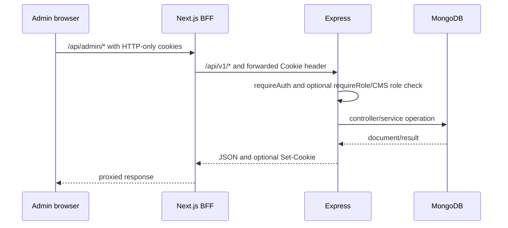

# System architecture

## Repository layout

```text
app/                    Next.js pages, metadata and route handlers
components/             public, admin, map, chat and playground UI
data/                   repository-backed public content and games
lib/                    BFF, CMS, OAuth, Insights and email helpers
olinethra-api/          independent Express/Mongoose application
  src/controllers/      transport and input validation
  src/routes/           all registered Express routes
  src/services/         domain and integration logic
  src/models/           Mongoose schemas
  tests/                Vitest/Supertest tests
ml/                     Python lead readiness/training/prediction
docs/                   technical and legacy integration documentation
```

## Runtime boundaries

The frontend and API are independently installable Node projects. `API_URL` is the server-side BFF target; `NEXT_PUBLIC_API_URL` is its public fallback. Browser code normally calls `/api/...` on Next.js, avoiding direct cross-origin API calls. `backendFetch` forwards the incoming cookie header, disables caching, applies a 15-second timeout, and relays `Set-Cookie` responses.

Express mounts one router below `/api/v1`, applies a general rate limiter to every operation, and layers JSON parsing, cookies, CORS, Helmet and Morgan. MongoDB must connect before the HTTP listener starts. An hourly in-process job closes expired open jobs/internships.

## Important data flows

### Public content

Static pages import `data/*.ts` or `data/cmsData.json`. Public Insights are server fetched from Express; `lib/insights.ts` falls back to three in-repository posts on failure. Public CMS endpoints also expose filtered active/published MongoDB content, but most marketing pages do not consume them directly.

### Admin



Admin route protection is client initiated by `AdminLayout`: it calls `/api/admin/auth/me` and redirects on 401. This improves UX but is not a server-side page gate. Express authentication remains the security boundary.

### Google authentication

Next.js creates state, nonce and PKCE values in a signed HTTP-only flow cookie, redirects to Google, exchanges the callback code, and sends the ID token plus nonce to Express. Express verifies the token audience/email/nonce, looks up an active MongoDB `User`, binds `googleSubjectId` on first login, and issues Olinethra JWT cookies.

### WhatsApp

Meta calls either the public Express webhook or its Next.js proxy. Express acknowledges events before asynchronous processing. Messages are deduplicated by external ID, stored, processed by the agent when AI is enabled, sent via Graph API, and persisted as outbound messages. Human messages switch a conversation to handoff and disable AI.

### Applications and inquiries

Zod validates submissions. Inquiries create `Inquiry`, `Notification`, `ActivityLog`, and a best-effort email. Applications require an open, unexpired matching Job/Internship and create the equivalent records and email. Email failure does not roll back persistence.

### AI and ML

Gemini requests are made directly from Express via REST. Insights output is JSON-parsed before it reaches an editor; publishing remains a separate call. The WhatsApp agent extracts lead data and drives qualification. Lead scoring starts a local Python process and stores predictions under `Lead.ml`; retraining exports lead fields to `ml/data/leads.json` before invoking the training script.

## Deployment topology

No provider-specific deployment manifest is present. A valid topology is a Next.js host plus a persistent Node host for Express, MongoDB (local or Atlas), and external providers. The in-process hourly job and local Python artifacts mean the API host needs a persistent process and writable filesystem if ML/training is used. See [deployment](../operations/deployment.md).
