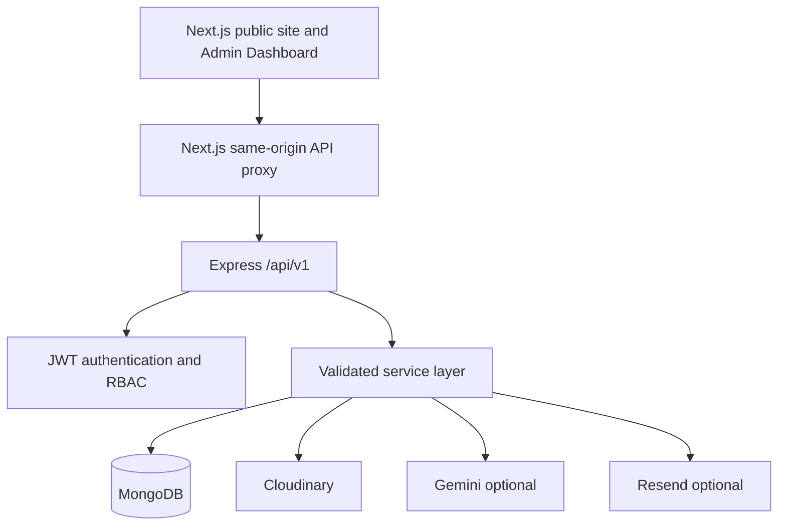

# Architecture

The BFF forwards browser calls and HTTP-only cookies. Express owns validation, authorization, persistence, notifications, expiry automation, email and AI grounding. Each CMS entity has a separate MongoDB collection; the `/admin/cms` compatibility endpoint preserves the current dashboard contract while public `/cms` returns only publishable data.

## Frontend dependency map

| Frontend feature | Express endpoint | Handler/service | Model | Access | Response |
|---|---|---|---|---|---|
| Portfolio and detail | `GET /projects`, `/projects/:slug` | public controller | Project | Public | `{success,data}` |
| Team | `GET /team` | public controller | TeamMember | Public | active members |
| Services | `GET /services` | public controller | Service | Public | active services |
| FAQ | `GET /faqs` | public controller | FAQ | Public | published FAQs |
| Careers | `GET /internships`, `/jobs` | public controller + expiry service | Internship, Job | Public | open, non-expired roles |
| Contact form | `POST /inquiries` | inquiry controller | Inquiry | Public/rate-limited | legacy-compatible inquiry |
| AI assistant | `POST /chat` | chat service | published CMS models | Public/rate-limited | grounded response/action |
| Admin login/session | `/auth/login`, `/auth/me`, `/auth/logout` | auth controller | User | Public/protected | user/session cookie |
| Admin CMS screens | `GET/POST /admin/cms` | CMS compatibility service | all CMS collections | Admin | existing dashboard shape |

